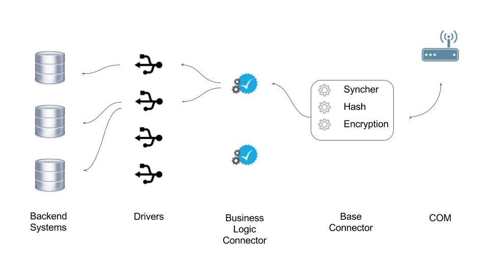

# Capriza Connectors
Backend systems connectors.

##Architecture
The architecture of a connector is composed of several layers - A base Connector, a Business Logic (BL) connector and Drivers that enable technical connection to the backend system.
 

###Drivers
A Driver is a technical object that provides access the a backend system API.
Examples:

* HTTP - A driver that enables connection to a REST API of a backend system.
* Web Engine - Provides a scripting ability to automatically run the backend system's WEB UI, extract data and perform actions.
* [node-rfc](https://github.com/SAP/node-rfc) - a node based driver that enables connection to SAP rfc functions.

Drivers does not contain business logic, and does not depend on the connector use-case.
Drivers does not have a predefined API.

###Business Logic (BL) Connector
A stateless object that contains the business logic of a use-case (e.g. expense approval, PO approval), of a **specific system** (e.g. Expense Approval **over Oracle EBS**).
The *BL connector* may use one or more *Drivers*, to implement the use-case.
The *BL Connector* should implement the following interface:

* **schema** - The schema and version {id, version} which used by the BL.
* **fetch()** - Connects to the source system, and fetches the data relevant for the use-case. The data returned should be formatted according to the corresponding ***schema***.
* **getApproval(approval)** - Fetches a single approval record, given an already fetched approval (for validation comparison). The returned value should be formatted according to the exact same ***Schema*** as the **fetch()** function, and return only ***pending*** approvals, otherwise return null.
* **approve(data)** - Performs the approve action in the source system given approval data and the approver credentials (if needed). the *data* input object is assumed to follow this structure {approval, credentials}
* **reject(data)** - Performs the reject action in the source system given approval data, the approver credentials (if needed), and a rejection reason (as string). the *data* input object is assumed to follow this structure {approval, credentials, rejectionReason}.
* **downloadAttachment(data)** - Downloads the attachment and returns a Uint8Array of binary data.

Important guidelines for the *BL Connector*:

* **Stateless** - the *BL Connector* should be stateless. Meaning each function from the former list should create a session to the source system, perform the action and then close the session and release any memory that was used.
* **Schema** - Each approval that is returned by the **fetch()** and **getApproval()** function should adhere to the exact same ***Schema***, so these would be easily comparable.
* **Approval Id** - Both **fetch()** and **getApproval()** functions should return an id field of type string in the *private* section of the approval. This id should uniqly identify the approval in the source system, per approver (In case the same approval can be approved by several approvers, it should be reflected in the id of the approval). In case the "real" source system id of the approval comprises of several fields, these should be added to the private section of the approval (see [*Schema*](https://caprizaportfolio.assembla.com/spaces/capriza-ng/git-7/source))
* **Approver** - Both **fetch()** and **getApproval()** functions should return an approver field of type string in the *private* section of the approval. The approver identifies the approver user of this approval. It should match the mapping of the source user id and the capriza user id.
* **Approvals 'pending' status** - Both **fetch()** and **getApproval()** should return approvals with 'pending' status.

###Base Connector
The *Base connector* is a general wrapper for each connector that uses a single *BL Connector* to implement a specific use-case in a specific system, and fulfill the *Backend* tasks:

* **Sync** - Enables to synchronize 2 different **fetch()** calls in order to determine the difference between those (added, removed, updated).
The sync function will receive an array of objects, each with the approval id (given by the *BL Connector*), and the approval signature (given by the *Base Connector*). It will use the *Syncher* component to compare the 2 lists and result in an "added-removed-updated" diff.
The response to the backend is a united list of approvals, where the updated and added approvals would contain the entire approval object, and the deleted would have another "deleted" flag.
* **Hash** - After each **fetch()** call, the *Base Connector* Creates an object (approval) signature using a hash function, for easy comparison between approvals, in later syncs.
* **Approve/Reject** - Given an approve/reject task, the *Base Connector* will first check the validity of the received approval (by using the **getApproval()** function of the *BL Connector*). If the approval is still valid, it will call the **approve/reject** function of the *BL Connector*. Then, it will re-fetch the approval and perform "sync" for that specific approval in order to update the backend with the latest status of this approval.
* **Added Data for each approval** - The base connector extends each approval object with:
    * **id** - A UUID given by the backend to approvals sent (new approvals wouldn't have an id).
    * **syncver** - Sync version represents the version of the record in the backend DB at the time it was send to the connector, it should be returned as is to the backend (new approvals wouldn't have an id).
    * **schemaId** - The data schema id of the approval.
    * **sourceUserId** - Signature (hash) that represents the source system user (based on the "approver" field in the private section of the approval).
    * **signature** - The hash result (string) of the whole approval object.
    * **deleted** - An optional flag that would mark an approval as deleted (relevant for sync).
  
    
    Final approval structure (root level): 
        {id, syncver, signature, sourceUserId, schemaId, public, private, [deleted]}

###COM component
Handles the communication with the *Backend* server, Pulls tasks and delegates these to the *Base Connector*.
              